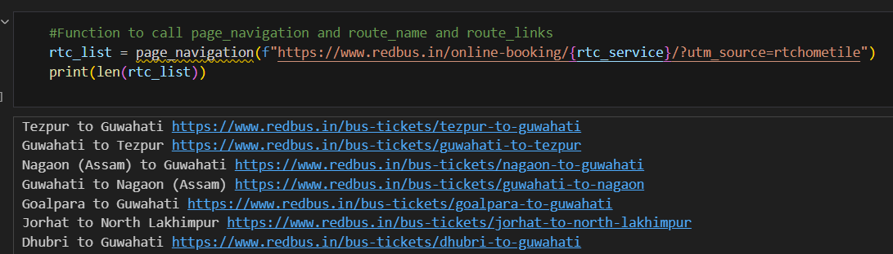
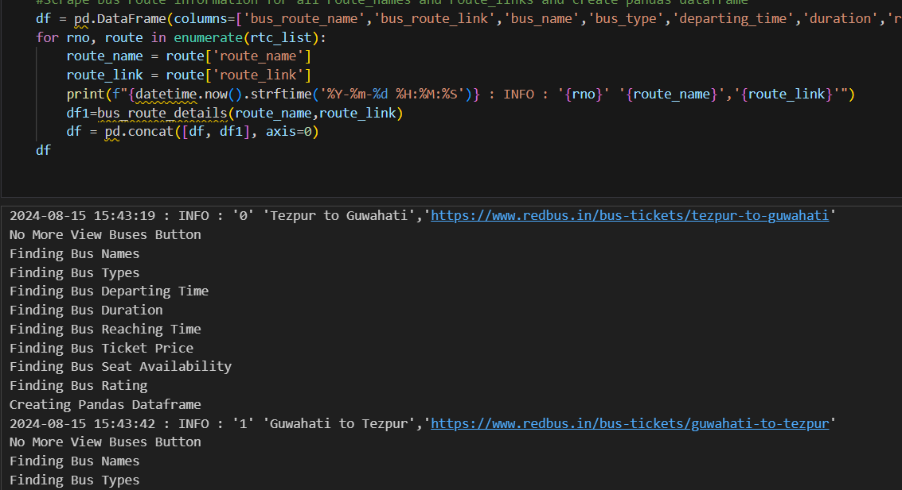
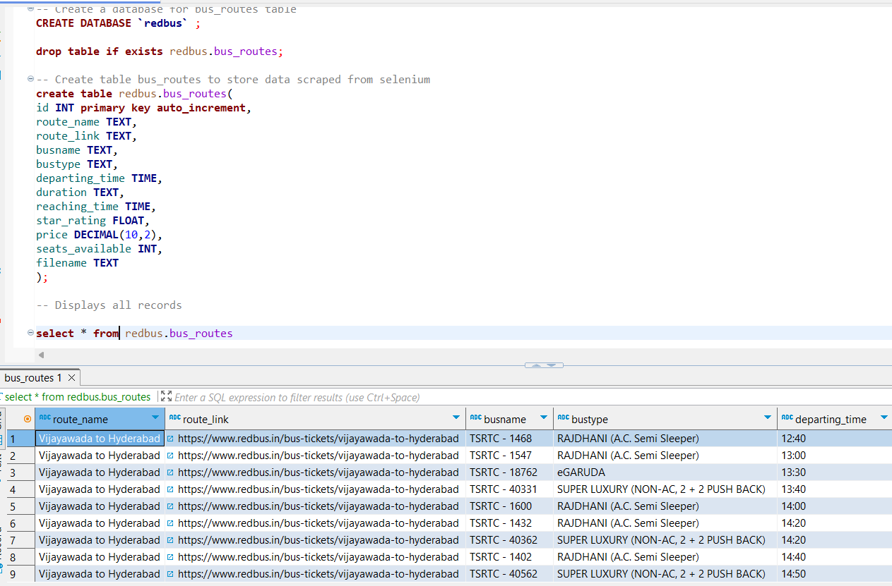
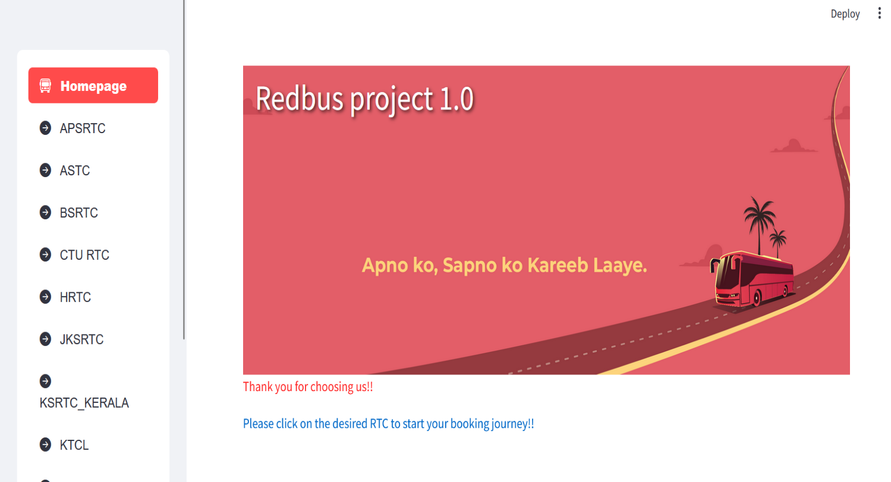
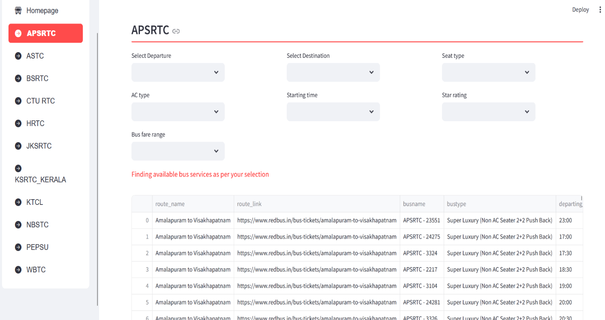
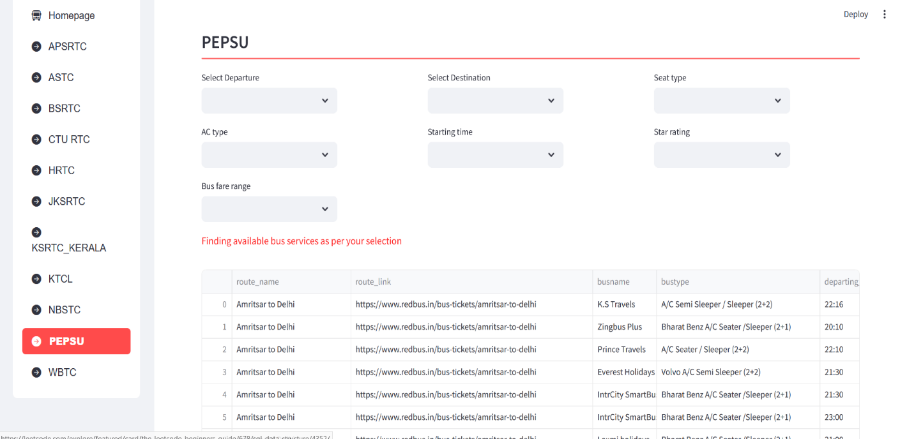

# Redbus Data Scraping with Selenium & Dynamic Filtering using Streamlit

  | Project Title    | Redbus Data Scraping with Selenium & Dynamic Filtering using Streamlit |
  | :--- | :--- |
  | **Skills take away** | **Web Scraping using Selenium, Python, Streamlit , From This Project SQL** |
  | **Domain**           | **Transportation**                                                         |

-   <ins>**Project Description:**</ins>
  This project aims at providing bus routes details of 12 Government RTC
bus services available on the redbus website using
    -   **Data collection** : Selenium as web scraping tool using python
      selenium library to scrape bus information
  
    -   **Data storage** : Collect the scraped data in a csv file and load
        to SQL database
    
    -   **Data cleansing** : Clean the data to filter out relevant
        information using pandaSQL Library
    
    -   **Data Visualization Tool**: Streamlit for displaying scraped on web
        app with filters to provide
        - Easy and better user experience with respective RTC option menu to
        filter out bus routes.
        - Bus routes as per convenient bus schedules along with travel
        duration.
        - Provide better seat type search.
        - Bus services based on star rating.
        - Bus schedules to determine customer needs based on starting and
        reaching time.
        - Bus fare range to choose price as per customer requirements.

-   **<ins>Data collection using Python selenium library</ins>**

    **Scraping process steps** :
      
      -  Function **scroll_to_bottom():** To achieve page scrolling to bottom
          of the page and move to next page to scrape list of route names from
          the entire page.
      
      -  Function **page_navigation():** Scrapes route names matching the
          xpath expression for each government bus rtc service on the redbus
          website and route link URL from hyperlink (href ) attribute which is
          used in next step to fetch the bus detail.
      
      -  Function **bus_route_details()** : This function fetches all the bus
          information for a given route link. If there are multiple Govt Bus
          services present , it will unhide the bus information of all Govt
          Bus Service, then it will scrape all the bus details mentioned below
          for both Govt and Private Bus Services and creates a list for each
          column.
      
              a.  Bus name
              b.  Bus type(Sleeper/Seater/AC/Non-AC)
              c.  Departing time
              d.  Duration
              e.  Reaching Time
              f.  Bus Ticket Price
              g.  Bus Seat Availability
              h.  Bus Star Rating
      
          Added logic for handling exception if star rating is not present for any
          of the bus service. Convert above lists to a pandas dataframe using
          dictionary.
      
      -  For each Govt bus service, a separate jupyter notebook has been
          created. It performs below steps,
      
          -   Find the route name and route links using page_navigation function
              and store it in a list.
          
      
      -  Loop through the list and find the bus details using
          bus_route_details function. A dataframe is created for each route
          which is finally concatenated to a single master dataframe.
   
         
      
          -   This master dataframe is written to a csv file with respective govt
              bus service name.
          
          -   This process is repeated in separate jupyter notebook for all the
              govt bus services.
    
-   **<ins>Database creation and storage:</ins>**

    -  In MySQL, create a database schema (**Redbus**)and create a table
        (**bus_routes**) to store the bus details.
    -  Read the csv file of each govt bus service and create a consolidated
        pandas dataframe.

-   **<ins>Data preprocessing and cleaning</ins> :**

    As part of data cleansing below operations are performed on this
    dataframe
    
    -  Column Name Correction
    -  Fetch Numeric value for Seat Availability Column
    -  Null record handling
    -  Formatted the RTC Name using file name column
    
    Use the cleansed dataframe to load the data into **redbus.bus_route**
    table in MySQL.

    

-   **<ins>Data Filtering and display in Streamlit Web app</ins>:**
  
    -  Function **get_mysqldata(query)** is to establish MYSQL connection and pull data using SQL alchemy engine to pandas dataframe
       
    -  Streamlit styling options like wide mode used for better user experience
      
    

    -  Sidebar selection menu added for displaying multiple RTC using Streamlit option menu.
      
    -  Function **route_name_filter(df,rtc_name):** Applies filter on dataframe based on RTC Option selected and displays page with different filters for Bus names, schedule, different price range, seat availability, and star rating options to get wide range of options for user.

-   **<ins>Respective RTC wise bus details for customized selection</ins>**

Example1: **APSRTC**

Example 2: **PEPSU**

## Steps to execute this project

**Step 1:** Install the python libraries required for this project using requirements.txt

**Step 2:** Execute respective RTC.ipynb files for all the RTC and its output CSV file will be generated in output_csv folder.

**Step 3:** Execute bus_routes.sql file in MySQL to create redbus databse schema and bus_routes table.

**Step 4:** Execute Redbus_mysql.ipynb notebook to load all the csv files into bus_routes table in MySQL.

**Step 5:** Execute Streamlit_Final.py to load the streamlit app in browser with below command 
streamlit run Streamlit_Final.py

